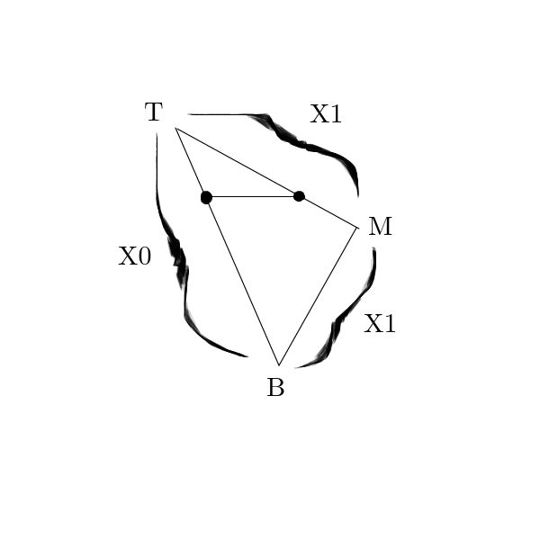

# Scanline Conversion

- Filling in a polygon by drawing consecutive horizontal or vertical lines
- Need to find the top, bottom, and middle verticies
- Need to find the endpoints of each scanline
- Y starts at `Yb`, ends at `Yt`, `y += 1`
- X0 starts at `Xb`, ends at `Xt`, `X0 += Δ0 = (Xt - Xb) / (Yt - Yb)` (on the line bottom-top)
- X1 starts at `Xb`, ends at `Xt`, changes at middle vertex, `X1 += Δ1 = (Xm - Xb) / (Ym - Yb) or (Xt - Xm) / (Yt - Ym)` (on the line bottom-middle until `y = Ym` then on middle-top)
  - set `X = Xm` when midpoint is reached

# Z Buffering

- Create a 2D array of floating point values, where each entry corresponds to a pixel in the screen
- We store the z-values of every plotted pixel in this array
- We check new z values against the z buffer before plotting
